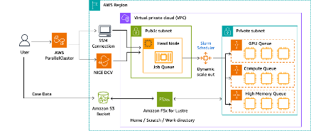

# Molecular Dynamics on Amazon EC2 hpc7g instances

This repository provides examples to run Molecular Dynamics applications on AWS using ParallelCluster and [Hpc7g instances](https://aws.amazon.com/ec2/instance-types/hpc7g/?trk=7aa1d67a-83b9-4934-8322-71040c588cf4&sc_channel=el), powered by Graviton 3E processors. As of today we have instructions for [GROMACS](https://www.gromacs.org/) and [LAMMPS](https://www.lammps.org/). By executing the scripts you see under the `/codes` folder, you can install these scientific applications with optimal compiler options.

## ParallelCluster

In this guide we assume that you are going to deploy a scalable HPC cluster on AWS using AWS ParallelCluster. Below is the reference architecture for this project. 

For detailed procedures on how to deploy AWS ParallelCluster on your AWS account, please follow the [official User Guide (v3)](https://docs.aws.amazon.com/parallelcluster/latest/ug/what-is-aws-parallelcluster.html). You can either use CLI or ParallelCluster UI to deploy the cluster. Either way, you can use the [configuration file template](/codes/setup/md-cluster.yaml). This template assumes that you have already created a VPC and subnets to deploy your cluster into. If you are not familiar with this process, follow [these steps](https://docs.aws.amazon.com/parallelcluster/latest/ug/install-v3-configuring.html) in the official User Guide.   

## Compilers & Libraries 

We recommend the following Compilers & Libraries:
- Operating System: Amazon Linux 2
- Compiler: Arm compiler for Linux (ACfL) ver. 23.04 & later
- Library: Arm performance libraries (ArmPL) ver. 23.04 & later, included in ACfL
- MPI: OpenMPI ver. 4.1.5 & later (latest official stable release)

Follow the instructions under the [Graviton getting started guide](https://github.com/aws/aws-graviton-getting-started/tree/main/HPC) to install ACfL and ArmPL. 

## GROMACS

To build GROMACS with optimized SVE settings, execute the [Buildscript_Gromacs_Onempi_ARMCL_SVE.sh](/codes/GROMACS/Buildscript_Gromacs_Openmpi_ARMCL_SVE.sh) script on the head node. This script assumes that you are using an EC2 instance with c7g.4xlarge for your head node. If you execute the script without modification it will install the software onto your home directory, but you can choose to change the installation directory by yourself. If you wish to do so, modify the part which says `cd /home/ec2-user/software/gromacs-2022.5`. 

Once you have successfully installed GROMACS, you can submit a job onto the compute nodes. [Runscript_testcaseA-onehpc7g.sbatch.sh](/codes/GROMACS/Runscript_testcaseA-onehpc7g.sbatch.sh) is an example of a Slurm job script for GROMACS. 

## LAMMPS

To build LAMMPS with optimized SVE settings, execute the [compile-lammps.sh](/codes/LAMMPS/compile-lammps.sh) script on the head node. This script assumes that you are using an EC2 instance with c7g.4xlarge for your head node.

Submit your job with [lammps-submit.sh](/codes/LAMMPS/compile-lammps.sh). 

## Security

See [CONTRIBUTING](CONTRIBUTING.md#security-issue-notifications) for more information.

## License

This library is licensed under the MIT-0 License. See the LICENSE file.
