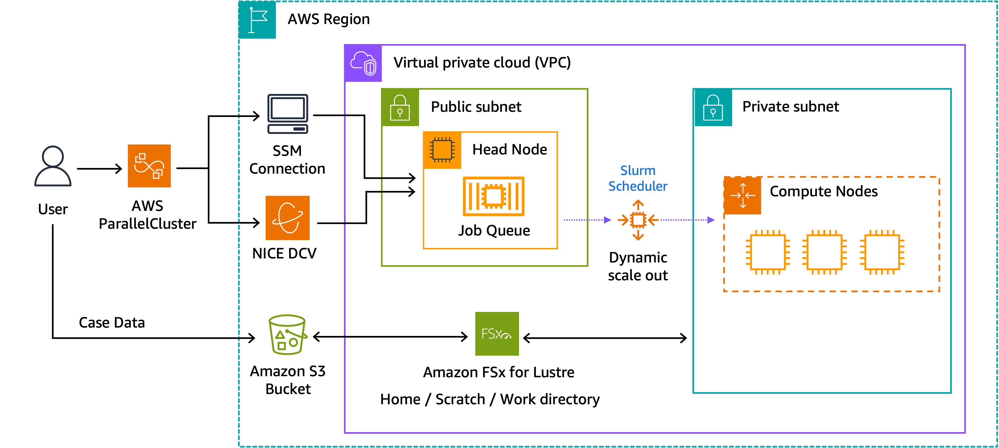

# Molecular Dynamics on Amazon EC2 hpc7g instances

This repository provides examples to run Molecular Dynamics applications on AWS using ParallelCluster and [Hpc7g instances](https://aws.amazon.com/ec2/instance-types/hpc7g/?trk=7aa1d67a-83b9-4934-8322-71040c588cf4&sc_channel=el), powered by Graviton 3E processors. As of today we have instructions for [GROMACS](https://www.gromacs.org/) and [LAMMPS](https://www.lammps.org/). By executing the scripts you see under the `/codes` folder, you can install these scientific applications with optimal compiler options.

## ParallelCluster

In this guide we assume that you are going to deploy a scalable HPC cluster on AWS using AWS ParallelCluster. Below is the reference architecture for this project. 



For detailed procedures on how to deploy AWS ParallelCluster on your AWS account, please follow the [official User Guide (v3)](https://docs.aws.amazon.com/parallelcluster/latest/ug/what-is-aws-parallelcluster.html). You can either use CLI or ParallelCluster UI to deploy the cluster. Either way, you can use the [configuration file template](/codes/setup/md-cluster.yaml). This template assumes that you have already created a VPC and subnets to deploy your cluster into. If you are not familiar with this process, follow [these steps](https://docs.aws.amazon.com/parallelcluster/latest/ug/install-v3-configuring.html) in the official User Guide.   

Once you have created your VPC and subnets, use this [configuration file](codes/setup/0-md-cluster.yaml) to deploy the cluster. Before you execute the command below, make usre to replace the subnets and ssh key information. 

```bash
pcluster create-cluster -n gv-cluster -c 0-md-clutser.yaml
```

[!Note]
All of the steps in this repo were performed on ParallelCluster version 3.6.0.

## Compilers & Libraries 

We recommend the following Compilers & Libraries:
- Operating System: Amazon Linux 2
- Compiler: Arm compiler for Linux (ACfL) ver. 23.04 & later
- Library: Arm performance libraries (ArmPL) ver. 23.04 & later, included in ACfL
- MPI: OpenMPI ver. 4.1.5 & later (latest official stable release)

### Arm Compiler and Arm Performance Libraries

To install ACfL use [this installation script](codes/setup/1-install-acfl.sh) on the head node of your newly created cluster. This will install **ACfL and ArmPL** under `/shared/tools`.  
You will see the following message if the installation is successful.

```
Unpacking...
Installing...The installed packages contain modulefiles under /shared/arm/modulefiles
You can add these to your environment by running:
                $ module use /shared/arm/modulefiles
Alternatively:  $ export MODULEPATH=$MODULEPATH:/shared/arm/modulefiles
```

### Open MPI

ParallelCluster by default comes with Open MPI pre-installed, but it is compiled with gcc. In order for us to use Open MPI with Arm compilers, we will need to compile it with the newly installed ACfL. We recommend using Open MPI version 4.1.5. Use [this script](codes/setup/2-install-openmpi-with-acfl.sh) to install Open MPI 4.1.5 with ACfL. 


## GROMACS

[GROMACS](https://www.gromacs.org/) is a free and open-source software suite for high-performance molecular dynamics and output analysis. If you follow the instructions below you will be able to download and install the application on your ParallelCluster environment. 

### Prerequisites

In order to install GROMACS you will need [cmake](https://cmake.org/). Install it on the head node by executing [this script](codes/GROMACS/0-install-cmake.sh). This script will download cmake under `~/software` and install it onto `/shared/tools/cmake-3.26.4-arm64`. 

### Download Source Code

Execute the [download script](codes/GROMACS/1-download-gromacs.sh) on the head node. This will download the GROMACS source code tar ball onto `~/software` and extract the files in it. 

### Compilation

To build GROMACS with optimized SVE settings, execute [this script](codes/GROMACS/2a-compile-gromacs-acfl-sve.sh) on the head node. The software will be installed under `/shared/gromacs2022.5-armcl-sve`.  

### Job Submission

If you have used [this configuration file](codes/setup/0-md-cluster.yaml) to deploy your ParallelCluster environment, the cluster is set up with the [Slurm workload manager](https://slurm.schedmd.com/documentation.html). Submit the first GROMACS job using [this example Slurm job submission script](codes/GROMACS/3-gromacs-acfl-sve.sh). You can do so by placing the script under your `/home` directory, and execute the following Slurm command. This will download the test case as well as execute the job on 1 instance. The test case being used here is [Test Case A - GluCl Ion Channel](https://repository.prace-ri.eu/ueabs/GROMACS/2.2/GROMACS_TestCaseA.tar.xz) from the [Unified European Application Benchmark Suite (UEABS)](https://repository.prace-ri.eu/git/UEABS/ueabs). 

```bash
sbatch 3-gromacs-acfl-sve.sh
```

## LAMMPS

[LAMMPS](https://www.lammps.org/) is a classical molecular dynamics simulator, and is used for particle-based modelling of materials. If you follow the instructions below you will be able to download and install the application on your ParallelCluster environment. 

### Download Source Code

Execute the [download script](codes/LAMMPS/1-download-lammps.sh) on the head node. This will download the LAMMPS source code onto `~/software`.

### Compilation

To build LAMMPS with the optimized SVE settings, execute [this script](codes/LAMMPS/2a-compile-lammps-acfl-sve.sh) on the head node. The software will be compiled, and executables will be copied under `/shared/lammps/armpl-sve`. 

### Job Submission

If you have used [this configuration file](codes/setup/0-md-cluster.yaml) to deploy your ParallelCluster environment, the cluster is set up with the [Slurm workload manager](https://slurm.schedmd.com/documentation.html). Submit the first LAMMPS job using [this example Slurm job submission script](codes/LAMMPS/3-lammps-acfl-sve.sh). You can do so by placing the script under your `/home` directory, and execute the following Slurm command. This will execute the job on 1 instance. The test case being used here is [Lennard Jones](https://www.lammps.org/bench.html#lj). 

```bash
sbatch 3-lammps-acfl-sve.sh
```

## Security

See [CONTRIBUTING](CONTRIBUTING.md#security-issue-notifications) for more information.

## License

This library is licensed under the MIT-0 License. See the LICENSE file.
